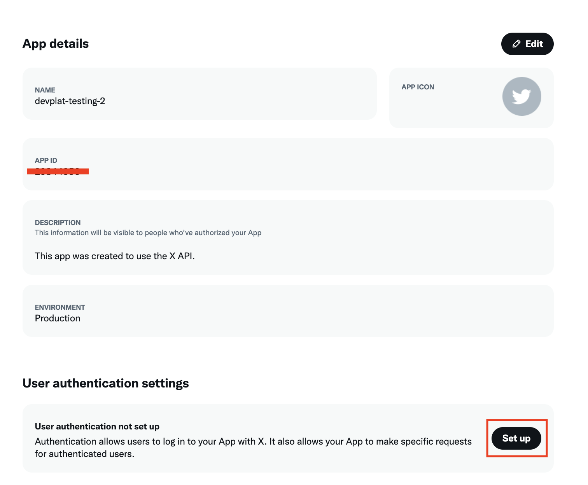
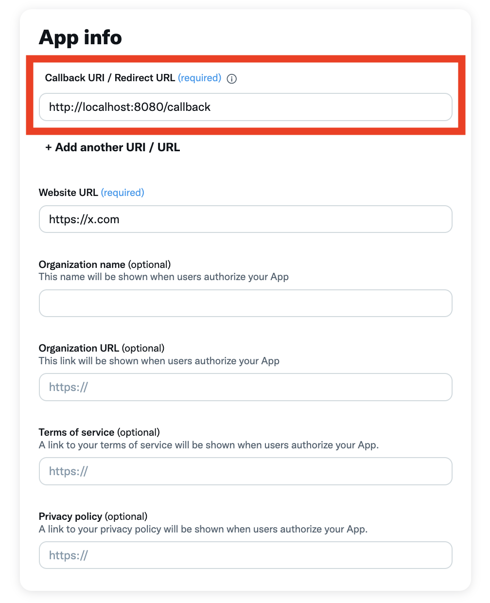

# xurl - A curl-like CLI Tool for the X API

A command-line tool for interacting with the X (formerly Twitter) API, supporting both OAuth 1.0a and OAuth 2.0 authentication.

## Features

- OAuth 2.0 PKCE flow authentication
- OAuth 1.0a authentication
- Multiple OAuth 2.0 account support
- Persistent token storage
- HTTP request customization (headers, methods, body)

## Installation
```bash
curl -fsSL https://raw.githubusercontent.com/xdevplatform/xurl/main/install.sh | sudo bash
```


## Usage

### Authentication

You must have a developer account and app to use this tool. 

#### App authentication:
```bash
xurl auth app --bearer-token BEARER_TOKEN
```

#### OAuth 2.0 User-Context
**Note:** For OAuth 2.0 authentication, you must specify the redirect URI in the [X API developer portal](https://developer.x.com/en/portal/dashboard).

1. Create an app at the [X API developer portal](https://developer.x.com/en/portal/dashboard).
2. Go to authentication settings and set the redirect URI to `http://localhost:8080/callback`.


3. Set the client ID and secret in your environment variables.
```env
export CLIENT_ID=your_client_id
export CLIENT_SECRET=your_client_secret
```
4. Get your access keys:
```bash
xurl auth oauth2
```
#### OAuth 1.0a authentication:
```bash
xurl auth oauth1 --consumer-key KEY --consumer-secret SECRET --access-token TOKEN --token-secret SECRET
```

### Authentication Management
View authentication status:
```bash
xurl auth status
```

Clear authentication:
```bash
xurl auth clear --all              # Clear all tokens
xurl auth clear --oauth1           # Clear OAuth 1.0a tokens
xurl auth clear --oauth2-username USERNAME  # Clear specific OAuth 2.0 token
xurl auth clear --bearer           # Clear bearer token
```

### Making Requests

Basic GET request:
```bash
xurl /2/users/me
```

Custom HTTP method:
```bash
xurl -X POST /2/tweets -d '{"text":"Hello world!"}'
```

Add headers:
```bash
xurl -H "Content-Type: application/json" /2/tweets
```

Specify authentication type:
```bash
xurl --auth oauth2 /2/users/me
xurl --auth oauth1 /2/tweets
xurl --auth app /2/users/me
```

Use specific OAuth 2.0 account:
```bash
xurl --username johndoe /2/users/me
```

## Token Storage

Tokens are stored securely in `~/.xurl` in your home directory.

## Contributing
Contributions are welcome!

## License
This project is open-sourced under the MIT License - see the LICENSE file for details.
