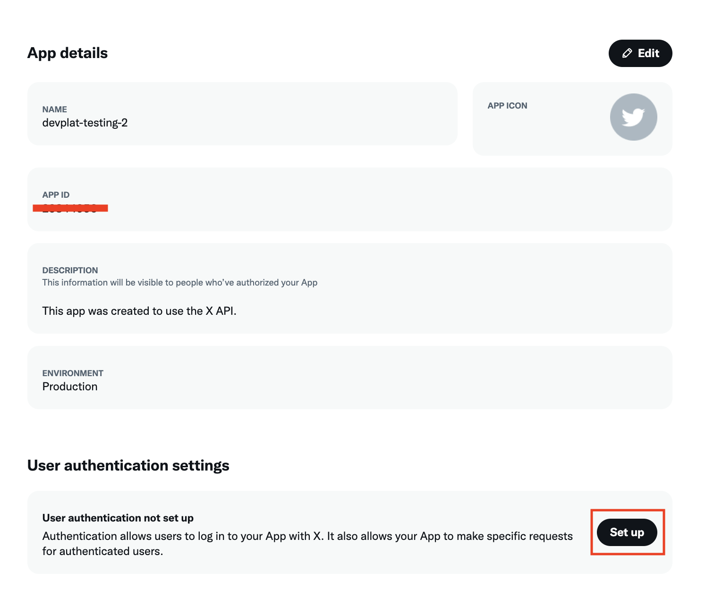
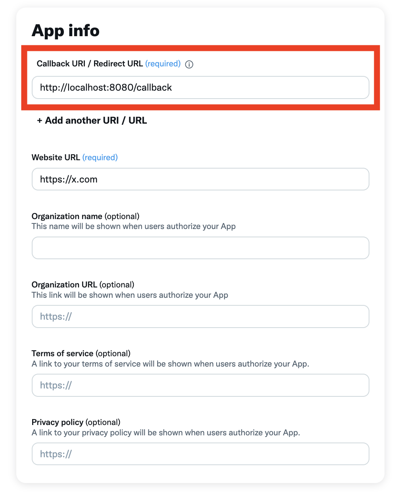

# xurl - A curl-like CLI Tool for the X API

A command-line tool for interacting with the X (formerly Twitter) API, supporting both OAuth 1.0a and OAuth 2.0 authentication.

## Features

- **Multi-app support** — register multiple X API apps with separate credentials and tokens
- OAuth 2.0 PKCE flow authentication
- OAuth 1.0a authentication
- Multiple OAuth 2.0 account support per app
- Default app and default user selection (interactive Bubble Tea picker or single command)
- Persistent token storage in YAML (`~/.xurl` or `$XURL_STORE_DIR/.xurl`), auto-migrates from legacy JSON
- HTTP request customization (headers, methods, body)
- Per-request app override with `--app`

## Installation

### Homebrew (macOS)
```bash
brew install --cask xdevplatform/tap/xurl
```

### npm
```bash
npm install -g @xdevplatform/xurl
```

### Shell script (no sudo required)
```bash
curl -fsSL https://raw.githubusercontent.com/xdevplatform/xurl/main/install.sh | bash
```
Installs to `~/.local/bin`. If it's not in your PATH, the script will tell you what to add.

### Go
```bash
go install github.com/xdevplatform/xurl@latest
```


## Usage

### Authentication

You must have a developer account and app to use this tool. 

#### Register an app

Register your X API app credentials so they're stored in `~/.xurl` (no env vars needed after this):

```bash
xurl auth apps add my-app --client-id YOUR_CLIENT_ID --client-secret YOUR_CLIENT_SECRET
```

If you want the app to keep its own callback configuration in `~/.xurl`, you can store the redirect URI there too:

```bash
xurl auth apps add my-app --client-id YOUR_CLIENT_ID --client-secret YOUR_CLIENT_SECRET --redirect-uri http://localhost:8080/callback
```

You can register multiple apps:
```bash
xurl auth apps add prod-app --client-id PROD_ID --client-secret PROD_SECRET
xurl auth apps add dev-app  --client-id DEV_ID  --client-secret DEV_SECRET
```

> **Legacy / env-var flow:** You can also set `CLIENT_ID` and `CLIENT_SECRET` as environment variables. They'll be auto-saved into the active app on first use.
>
> `REDIRECT_URI` now resolves in this order: `REDIRECT_URI` environment variable, then the app's stored `redirect_uri` in `~/.xurl`, then the built-in default `http://localhost:8080/callback`.

#### OAuth 2.0 User-Context
**Note:** For OAuth 2.0 authentication, you must specify the redirect URI in the [X API developer portal](https://developer.x.com/en/portal/dashboard).

1. Create an app at the [X API developer portal](https://developer.x.com/en/portal/dashboard).
2. Go to authentication settings and set the redirect URI to the same value that `xurl` will use through `REDIRECT_URI`.
   The default is `http://localhost:8080/callback`, and `xurl` derives the callback host, port, and path from the effective redirect URI. The effective value is resolved from `REDIRECT_URI`, then the app's stored `redirect_uri`, then the built-in default. When you use `localhost`, `xurl` listens on both `127.0.0.1` and `::1` so browser loopback resolution does not break the callback.


3. Register the app (if you haven't already):
```bash
xurl auth apps add my-app --client-id YOUR_CLIENT_ID --client-secret YOUR_CLIENT_SECRET
```
4. Get your access keys for the registered app:
```bash
xurl auth oauth2 --app my-app
```

If you omit `--app`, the token is saved to the current default app. You can also run `xurl auth default my-app` first and then use `xurl auth oauth2`.

**Headless / remote machines.** The default flow opens a browser and waits for a callback on `localhost`, which isn't reachable from a remote server. On those hosts use `--headless`:

```bash
xurl auth oauth2 --app my-app --headless
```

xurl prints the authorization URL; open it on any device with a browser, approve, then paste the resulting redirect URL (or just the `code` value from the address bar) back into the prompt. No callback listener is needed — the page failing to load is expected; the code is in the URL.

If X returns a `client-forbidden` / `client-not-enrolled` error even though auth completed successfully, check the app’s package and environment in the X developer console. On current X platform setup, the working fix was:

1. Go to `Apps` -> `Manage apps`
2. Open the app
3. Use `Move to package`
4. Choose `Pay-per-use`
5. Move the app to the `Production` environment

Without that enrollment step, `xurl whoami` and other `/2/*` reads can fail even when the OAuth callback and tokens are valid.

If X does not return your username reliably through `/2/users/me`, authenticate with an explicit handle instead:

```bash
xurl auth oauth2 --app my-app YOUR_USERNAME
```

That keeps the OAuth2 token associated with the expected username and also gives shortcut commands a fallback when `/2/users/me` is unavailable.

#### App-only authentication (Bearer Token):
```bash
xurl auth app-only BEARER_TOKEN
cat token.txt | xurl auth app-only -          # read from stdin (keeps it out of shell history)
```
This stores X's app-only Bearer Token (from the developer portal), used at request time with `--auth app`. It's named for the auth *mode* (app-only) rather than the token *scheme* (bearer), since OAuth2 user tokens are also sent as `Authorization: Bearer`.
> Back-compat: `xurl auth app` and `xurl auth bearer` still work as aliases, and `--bearer-token TOKEN` is still accepted.

#### OAuth 1.0a authentication:
```bash
xurl auth oauth1 --consumer-key KEY --consumer-secret SECRET --access-token TOKEN --token-secret SECRET
```

### Multi-App Management

List registered apps:
```bash
xurl auth apps list
```

Update credentials on an existing app:
```bash
xurl auth apps update my-app --client-id NEW_ID --client-secret NEW_SECRET
xurl auth apps update my-app --redirect-uri http://localhost:8080/callback
```

`REDIRECT_URI` from the environment still overrides the stored app value at runtime, so `auth apps update --redirect-uri` is best for your default per-app callback while env vars remain the temporary override path.

View the effective and stored redirect URI for an app:
```bash
xurl auth apps redirect-uri get my-app
```

Set the stored redirect URI for an app:
```bash
xurl auth apps redirect-uri set my-app http://localhost:8080/callback
```

Remove an app:
```bash
xurl auth apps remove old-app
```

Set the default app and user — **interactive picker** (uses Bubble Tea):
```bash
xurl auth default
```

Set the default app and user — **single command**:
```bash
xurl auth default my-app              # set default app
xurl auth default my-app alice        # set default app + default user
```

Use a specific app for a single request:
```bash
xurl --app dev-app /2/users/me
```

### Authentication Status
View authentication status across all apps:
```bash
xurl auth status
```

This output shows the effective redirect URI for each app and, when `REDIRECT_URI` is set in the environment, also shows the stored app value separately so precedence is visible.

Example output:
```
▸ my-app  [client_id: VUttdG9P…]
      redirect_uri: http://localhost:8080/callback  [app config]
    ▸ oauth2: alice
      oauth2: bob
      oauth1: ✓
      bearer: ✓

  dev-app  [client_id: OTHER789…]
      redirect_uri: http://localhost:8080/callback  [built-in default]
      oauth2: (none)
      oauth1: –
      bearer: –
```

### X Platform Enrollment Troubleshooting

If OAuth succeeds but reads like `xurl whoami` fail with an error body containing `client-forbidden` or `client-not-enrolled`, the current X platform fix is to move the app into the `Pay-per-use` package and use the `Production` environment in the developer console. This is an X platform enrollment issue, not a local callback-listener issue in `xurl`.

`▸` on the left = default app. `▸` next to a user = default user.

### Clear Authentication
```bash
xurl auth clear --all                       # Clear all tokens
xurl auth clear --oauth1                    # Clear OAuth 1.0a tokens
xurl auth clear --oauth2-username USERNAME  # Clear specific OAuth 2.0 token
xurl auth clear --bearer                    # Clear bearer token
```

### Making Requests

Basic GET request:
```bash
xurl /2/users/me
```

Custom HTTP method:
```bash
xurl -X POST /2/tweets -d '{"text":"Hello world!"}'
```

Add headers:
```bash
xurl -H "Content-Type: application/json" /2/tweets
```

Specify authentication type:
```bash
xurl --auth oauth2 /2/users/me
xurl --auth oauth1 /2/tweets
xurl --auth app /2/users/me
```

Use specific OAuth 2.0 account:
```bash
xurl --username johndoe /2/users/me
```

### Streaming Responses

Streaming endpoints (like `/2/tweets/search/stream`) are automatically detected and handled appropriately. The tool will automatically stream the response for these endpoints:

- `/2/tweets/search/stream`
- `/2/tweets/sample/stream`
- `/2/tweets/sample10/stream`
- `/2/tweets/firehose/stream/lang/en`
- `/2/tweets/firehose/stream/lang/ja`
- `/2/tweets/firehose/stream/lang/ko`
- `/2/tweets/firehose/stream/lang/pt`

For example:
```bash
xurl /2/tweets/search/stream
```

You can also force streaming mode for any endpoint using the `--stream` or `-s` flag:
```bash
xurl -s /2/users/me
```

### Printing an Access Token

`xurl token` prints a valid OAuth2 access token for the active app to stdout (a single line, no decoration). If the stored token has expired it is refreshed and persisted first. This command never opens a browser, so it is safe to use in scripts:

```bash
xurl token                 # token for the default app/user
xurl token --app my-app    # token for a specific app
xurl token -u alice        # token for a specific OAuth2 user
TOKEN=$(xurl token) && curl -H "Authorization: Bearer $TOKEN" https://api.x.com/2/users/me
```

If no token is available (and none can be refreshed), it exits non-zero with a hint to run `xurl auth oauth2`.

### MCP Server (`xurl mcp`)

`xurl mcp` turns xurl into a [Model Context Protocol](https://modelcontextprotocol.io) bridge for the hosted X API MCP server. It reads newline-delimited JSON-RPC from stdin, relays each message to a remote Streamable HTTP MCP endpoint with an `Authorization: Bearer <token>` header, and writes the server's responses (plain JSON or `text/event-stream`) back to stdout as newline-delimited JSON. The MCP session id is maintained automatically and the token is refreshed in-process as it expires.

Because X's OAuth requires your own app (there is no dynamic client registration), xurl holds the app identity and mints/refreshes the token. On first run with no cached token, the bridge opens the browser for a one-time OAuth2 login using the `CLIENT_ID`/`CLIENT_SECRET` from its environment, then caches and auto-refreshes the token for subsequent runs. The MCP handshake is held until that login completes, so give the server a generous `startup_timeout_sec`.

Use it directly from any MCP client (Claude Desktop, Cursor, etc.) with a standard MCP server config — no separate install step is needed thanks to the npm launcher:

```json
{
  "mcpServers": {
    "xapi": {
      "command": "npx",
      "args": ["-y", "@xdevplatform/xurl", "mcp", "https://api.x.com/mcp"],
      "env": { "CLIENT_ID": "...", "CLIENT_SECRET": "..." },
      "startup_timeout_sec": 300
    }
  }
}
```

Requirements for the first-run browser login: a browser on the machine running the client, and your X app must have the OAuth2 redirect URI `http://localhost:8080/callback` registered (or set `REDIRECT_URI` to one that is). On a headless host with no reachable browser, authenticate out-of-band first with `xurl auth oauth2 --headless` (the bridge then just reuses the cached token).

The `<url>` positional is optional and defaults to `https://api.x.com/mcp`. `--app` is honored, so you can point a client at a specific registered app:

```bash
xurl --app my-app mcp                       # bridge the default endpoint using my-app
xurl mcp https://api.x.com/mcp              # explicit endpoint
```

All diagnostics are written to stderr so stdout stays a clean JSON-RPC channel.

### Temporary Webhook Setup

`xurl` can help you quickly set up a temporary webhook URL to receive events from the X API. This is useful for development and testing.

1.  **Start the local webhook server with ngrok:**

    Run the `webhook start` command. This will start a local server and use ngrok to create a public URL that forwards to your local server. You will be prompted for your ngrok authtoken if it's not already configured via the `NGROK_AUTHTOKEN` environment variable.

    ```bash
    xurl webhook start
    # Or with a specific port and output file for POST bodies
    xurl webhook start -p 8081 -o webhook_events.log
    ```

    The command will output an ngrok URL (e.g., `https://your-unique-id.ngrok-free.app/webhook`). Note this URL.

2.  **Register the webhook with the X API:**

    Use the ngrok URL obtained in the previous step to register your webhook. You'll typically use app authentication for this.

    ```bash
    # Replace https://your-ngrok-url.ngrok-free.app/webhook with the actual URL from the previous step
    xurl --auth app /2/webhooks -d '{"url": "<your ngrok url>"}' -X POST
    ```

    Your local `xurl webhook start` server will then handle the CRC handshake from Twitter and log incoming POST events (and write them to a file if `-o` was used).

### Media Upload

The tool supports uploading media files to the X API using the chunked upload process.

Upload a media file (the media type and category are auto-detected from the file extension):
```bash
xurl media upload path/to/file.mp4
xurl media upload path/to/photo.jpg
```

Override the auto-detected media type and category when needed:
```bash
xurl media upload --media-type image/jpeg --category tweet_image path/to/image.jpg
```

Check media upload status:
```bash
xurl media status MEDIA_ID
```

Wait for media processing to complete:
```bash
xurl media status --wait MEDIA_ID
```

#### Direct Media Upload

Most users should just use `xurl media upload` above. If you need to drive the
chunked upload manually, use the `-F` flag with the path-style endpoints that
`xurl media upload` itself uses:

1. First, initialize the upload:
```bash
xurl -X POST /2/media/upload/initialize -d '{"total_bytes": FILE_SIZE, "media_type": "video/mp4", "media_category": "tweet_video"}'
```

2. Then, append the media chunks (repeat with an increasing `segment_index`):
```bash
xurl -X POST -F path/to/file.mp4 /2/media/upload/MEDIA_ID/append
```

3. Finally, finalize the upload:
```bash
xurl -X POST /2/media/upload/MEDIA_ID/finalize
```

4. Check the status:
```bash
xurl '/2/media/upload?command=STATUS&media_id=MEDIA_ID'
```

## Token Storage

Tokens and app credentials are stored in `~/.xurl` in YAML format. Set `XURL_STORE_DIR` to use a different folder, for example with a mounted container volume:

```bash
docker run -v "$PWD/xurl-data:/xurl-data" -e XURL_STORE_DIR=/xurl-data ...
```

With that setting, xurl stores tokens at `/xurl-data/.xurl` and imports `.twurlrc` from `/xurl-data/.twurlrc`.

Each registered app has its own isolated set of tokens. Example:

```yaml
apps:
  my-app:
    client_id: abc123
    client_secret: secret456
    redirect_uri: http://localhost:8080/callback
    default_user: alice
    oauth2_tokens:
      alice:
        type: oauth2
        oauth2:
          access_token: "..."
          refresh_token: "..."
          expiration_time: 1234567890
    bearer_token:
      type: bearer
      bearer: "AAAA..."
default_app: my-app
```

> **Migration:** If you have an existing JSON-format `~/.xurl` file from a previous version, it will be automatically migrated to the new YAML multi-app format on first use. Your tokens are preserved in a `default` app.

## Contributing
Contributions are welcome!

## License
This project is open-sourced under the MIT License - see the LICENSE file for details.
